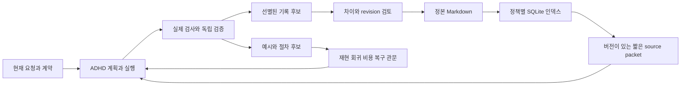

# ADHD와 Obsidian 연결

기존 위키의 정본 Markdown과 `wiki_context.py`를 그대로 사용한다. ADHD가 작업 시작 전에 짧은 근거를 검색하고, 완료 후 재사용할 가치가 있는 결과만 검토 후보로 남긴다. 위키 문장은 출처 자료이며 실행 권한이나 시스템 지시가 아니다. 현재 사용자 요청과 작업 계약이 우선한다.

설계는 아래 연구·공식 문서·공개 사용자 경험을 참고한다. 검색 정확도, 기록 비용, 사용자 만족도는 각각 측정한다. 작은 진단 fixture의 성적을 실사용 성공률로 해석하지 않는다.

- [Lost in the Middle](https://arxiv.org/abs/2307.03172), [LongMemEval](https://arxiv.org/abs/2410.10813): 긴 문맥에서의 근거 위치와 장기기억 평가 능력을 분리한다.
- [Mem0](https://arxiv.org/abs/2504.19413), [WikiSkill](https://arxiv.org/html/2608.27454), [SWE Context Bench](https://arxiv.org/html/2602.08316v3), [Evaluating AGENTS.md](https://arxiv.org/html/2602.11988v3): 선별 조회·경험 재사용·검증을 연구하되 각 평가 수치를 이 구현의 절감률로 전용하지 않는다.
- [Anthropic context engineering](https://www.anthropic.com/engineering/effective-context-engineering-for-ai-agents), [MCP code execution](https://www.anthropic.com/engineering/code-execution-with-mcp): 가벼운 포인터와 필요한 시점의 조회, 중간 결과 필터링을 참고한다.
- [Obsidian Properties](https://obsidian.md/help/properties), [Bases](https://obsidian.md/help/bases): 기존 속성과 Markdown 정본을 유지한다.
- [Agent Client 사용자 스레드](https://forum.obsidian.md/t/new-plugin-agent-client-bring-claude-code-codex-gemini-cli-inside-obsidian/108448), [Cortex 사용자 스레드](https://forum.obsidian.md/t/plugin-cortex-an-ai-obsidian-vault-agent-powered-by-claude-code/112430): 통합 편의와 세션·복잡성에 관한 직접 경험이다. 대표성 있는 사용자 시험이나 현재 플러그인 기능 검증으로 취급하지 않는다.

## 기록 정책

1. 모든 작업을 장문으로 기록하지 않는다. 결정, 명시적인 사용자 평가, 근거가 있는 재사용 가능한 성공, 별개 작업에서 반복된 중요한 실패를 선별한다. 나머지는 짧은 이벤트 흔적만 남긴다. 자동 완료 기록도 독립 검증의 완료 상태가 디스크에 확정되어야 선택된다.
2. 모델에게 전체 대화를 다시 요약시키지 않는다. 필드 기반 후보 생성, 작업·결과 revision·종류의 중복 키, 파일/hash/receipt 참조를 사용한다. 같은 이벤트의 재전송은 중복이고, 다른 작업에서 같은 실패가 발생한 것은 새 관찰이다.
3. 최초 검색 후 ID·section·revision으로 필요한 부분만 읽는다. SQLite에는 변경한 원문만 다시 파싱한다. 파일 이동, 같은 mtime의 수정, 정책 변경도 매 조회마다 현재 파일/hash와 대조한다. 빠른 검색을 위해 검증을 생략하지 않는다.
4. 정본·로그·인덱스·백업을 구분해 용량을 집계한다. 중복 보고는 삭제 명령이 아니다. 종료된 run의 검증한 로그만 명시적으로 압축하고, 원본 해제는 별도 선택이다. SHA-256과 경로가 맞는 복원을 검사한다. 논리적 바이트 감소를 실제 디스크 확보량으로 보고하지 않는다.
5. 긍정·부정·혼합·미수집 평가에 원문, 출처, 평가 축, 작업/프로젝트 범위, 결과 revision을 붙인다. 기술 검사 통과와 사용자 만족은 별도다. 단일 작업 평가에서 전역 취향을 추론하지 않는다.
6. 공통 템플릿은 상황/관찰/사용자 평가/검증/다음 행동/근거의 짧은 틀이다. 결정·사고·성공·절차에는 필요한 조건만 추가한다. 기존 flat frontmatter의 block list, canonical ID, 기존 링크를 유지한다. Obsidian Bases는 검토와 절차의 두 화면을 제공한다.
7. 성공 코드는 저장할 가치가 있다. 저장 방식은 Git commit·파일·blob hash와 필요한 worktree hash, 또는 문서·hash·요구사항·검사 receipt의 참조다. 성공 예시를 자동 실행 절차로 바꾸지 않는다. 독립된 재현·회귀·실측 비용·복구 근거가 갖춰진 후보만 controller가 채택한다.

## 데이터와 권한



`schema_version`, vault ID, canonical ID, 원문 revision, 정책 epoch, 인덱스 generation, 위치/section, 검증 범위, `authority: source_data`가 packet에 포함된다. JSON 문자 예산은 토큰 예산과 다르다. 경로 이탈, reparse point, 중복 ID, 모르는 privacy, 지원되지 않는 frontmatter, stale revision은 실패 시 자료를 내보내지 않는다. 검색 제외·삭제·forget은 인덱스 tombstone과 현재 정책을 확인한다. 다른 노트가 그 자료를 인용했다는 이유로 함께 forget하지 않는다.

다른 workspace의 동일 vault는 같은 vault ID를 쓴다. 이미 연결한 설정을 다른 vault에 몰래 재지정하지 않는다. 파일 이동 별칭과 내용 hash 별칭은 유지하며, 명시적인 원문 ID가 인용 출처보다 우선한다. 프로젝트가 불명확하면 project를 명시한다. 충돌 관계와 유효 기간을 반환하며 오래된 결정의 현재 적용을 단정하지 않는다.

`memory recall`은 활성화한 프로젝트에서 필요한 위키 근거를 함께 반환한다. 원문 ID와 관찰 revision이 같은 기존 기억만 중복 제거한다. 전역 기억 호출과 비활성화 설정은 기존 경로를 따른다. 검색한 위키 텍스트를 recipe로 설치하지 않는다.

## 연결과 사용

아래 명령은 agent가 실행하는 인터페이스이며 사용자에게 매번 입력을 요구하기 위한 절차가 아니다. `adhd.py`는 현재 소스 또는 설치된 release의 파일이다. 예시 설정의 경로는 실제 vault로 바꾼다.

```powershell
python adhd.py wiki configure --workspace <project> --payload-file config.json
python adhd.py wiki context --workspace <project> --query "현재 작업" --project "ADHD" --max-chars 6500
python adhd.py wiki project --workspace <project> --query "개인 위키"
python adhd.py wiki read --workspace <project> --id <canonical-id> --section "검증과 한계" --revision <sha256>
python adhd.py memory recall --workspace <project> --query "현재 작업" --project "ADHD"
```

설정은 `<project>/.adhd/obsidian.json`에 저장한다. 처음에는 `enabled: false`, `write_enabled: false`이고 읽기 privacy는 public만 허용한다. 읽기 허용과 쓰기 허용은 각각 명시한다. 개인 vault를 연결하는 프로젝트에서 private를 선택한 경우에만 개인 근거를 검색한다. credentials/config/model/effort/router는 이 설정의 대상이 아니다.

```json
{
  "vault": "C:/Vault",
  "engine": "99 시스템/도구/wiki_context.py",
  "enabled": true,
  "read_roots": ["10 기록", "20 지식", "30 인덱스", "99 운영"],
  "allowed_privacy": ["public", "private"],
  "write_enabled": true,
  "write_roots": ["10 기록/아티팩트", "10 기록/프로젝트", "20 지식", "99 시스템/템플릿/ADHD", "99 시스템/베이스"]
}
```

native begin의 기존 `recipes` 진입점은 `.adhd/wiki-plan-context.json`에 최대 3개 근거를 저장한다. skill은 작업당 한 번 확인하고, 실제 행동 전에 live revision을 다시 검사한다. 잘못된 설정은 빈 경고 packet으로 바꾸므로 오래된 cache를 재사용하지 않는다. 기존 모델을 낮추거나 별도 legacy loop를 시작하지 않는다.

native 완료 저장이 enclosing state flush보다 먼저 호출되면 `.adhd/experience/pending-completions`에 참조만 남긴다. `wiki record-completion`으로 공개된 실제 완료 상태를 다시 읽는다. 완료되었다는 불리언이나 임의 JSON만으로 성공을 인증할 수 없다. 기록을 선택해도 vault에 바로 적용하지 않는다.

```powershell
python adhd.py wiki feedback --workspace <project> --payload-file feedback.json
python adhd.py wiki record-completion --workspace <project> --payload-file completion-pointer.json
python adhd.py wiki review --workspace <project>
python adhd.py wiki apply --workspace <project> --id <candidate-id>
```

후보는 `.adhd/experience/ledger.json`에 저장한다. apply는 현재 쓰기 범위, 예상 원문 hash, 후보 hash를 확인하고 잠금과 atomic replace를 사용한다. 사용자 수정이 있으면 덮어쓰지 않는다. 작성 중 중단과 동일 이벤트 재실행은 ledger로 복구한다. 생성한 기록에는 사용자 평가 원문과 기술 검증 범위가 따로 들어간다. `examples/obsidian/feedback.json`은 형식 예시이며 실제 평가로 사용하지 않는다.

## 위키 구조 적용과 복구

```powershell
python adhd.py wiki template --workspace <project> --operation preview
python adhd.py wiki template --workspace <project> --operation apply
python adhd.py wiki template --workspace <project> --operation restore-templates --payload-file restore-provision.json
```

preview는 정확한 diff와 예상 revision을 반환한다. apply는 다섯 템플릿, 두 Base, ADHD 프로젝트와 운영 지식, 기존 개인 위키 기록의 연결 구역을 준비한다. 기존 개인 위키 ID와 본문을 보존한다. `.adhd/provision/<id>/manifest.json`과 원본 백업을 먼저 저장하고 변경한다. 복구 payload는 `{"manifest":".adhd/provision/<id>/manifest.json"}`이다. 생성 후 사용자 편집이 있으면 복구를 거부한다. 복구 시 생성한 현재 파일도 별도 보관한다.

프로젝트 기록은 원본 작업 증거를 연결하고 지식은 실제 기록의 wikilink를 `seed_records`에 둔다. 템플릿은 검색에서 제외된다. 기존 위키 doctor와 parser로 ID·출처·seed/link를 검사한다. 자동 URI는 정책에 맞는 노트에 대해서만 생성하며 Obsidian을 자동 실행하지 않는다.

## 절차와 저장공간

`wiki procedure --operation propose`는 검증한 source completion을 참조하는 example과 distinct replay completion을 참조하는 candidate를 구분한다. 현재 native 상태·artifact bytes·review·criteria·receipt hash를 함께 확인한다. CLI의 adopt는 거부하며 controller의 sealed evidence API를 통해서만 채택한다. 이전 version과 환경 조건을 보존하고 `rollback`으로 복원한다. 코드의 Git blob hash와 CRLF 등의 worktree bytes hash는 구분한다. 문서 참조에는 hash와 적용 요구사항을 함께 둔다.

```powershell
python adhd.py wiki storage --workspace <project> --operation inventory
python adhd.py wiki storage --workspace <project> --operation audit --payload-file references.json
python adhd.py wiki storage --workspace <project> --operation archive --payload-file archive.json
python adhd.py wiki storage --workspace <project> --operation restore --payload-file restore.json
```

archive payload: `{"run_id":"<32 hex>","receipts":[".adhd/checks/<32 hex>/receipt.json"],"release":false}`. restore payload: `{"manifest":".adhd/evidence-archives/<32 hex>/manifest.json"}`. 실제 기존 archive/codec를 byte-identical asset과 검증한 source manifest로 재사용한다. 압축 전 완료 상태와 참조 closure를 검사한다. active/resumable/unknown run, 자식/lease, 미완료 batch, 다른 run의 참조는 보호한다. 기본값은 원본 보존이다. receipt를 바꾸지 않고 원본 로그 경로와 bytes를 복원한다. 자동 GC/정본 삭제는 없다.

## 측정과 배포 검증

`wiki usage-record`는 capture/retrieval/execution/child/verification/curation/retry 등 실제 호출을 `call_id`로 중복 제거한다. `input_tokens`, `output_tokens`, `cached_input_tokens`를 알고 있는 경우에만 숫자로 저장한다. 미측정은 null이며 0이 아니다. 선택되지 않은 기록 생성과 재시도 비용도 분모에 포함한다. `wiki usage`는 알려진 합계와 미측정 호출 수를 함께 반환한다. native App에서 관찰되지 않은 전체 토큰을 계산한 것처럼 보고하지 않는다.

평가 fixture는 프로젝트/별칭/결정·근거/유효기간/부재·충돌/privacy의 6종류 × 6개, 개발 24개·보류 12개다. 기존 A/인덱스 초기 B/인덱스 재사용 C를 같은 snapshot에 순서를 교차하며 3회 비교한다. B는 SQLite cache만 초기화하며 OS cache와 프로세스 cache는 통제하지 않는다. 예열 호출의 시간도 별도 보고한다. holdout을 본 후 검색을 조정하면 그것은 개발 데이터가 되므로 별도 신규 holdout이 필요하다.

```powershell
python scripts/benchmark_obsidian.py --engine <actual-wiki_context.py> --split dev --out benchmark-dev.json
python scripts/benchmark_obsidian.py --engine <actual-wiki_context.py> --split all --out benchmark-final.json
python -m unittest tests.test_obsidian_integration tests.test_obsidian tests.test_experience tests.test_experience_procedures tests.test_experience_storage -q
```

임베딩은 실측 전체 비용·실패 개선 근거가 있을 때만 후속 채택한다. 명시적인 한 단계 링크 확장과 URI는 선택적 기능이다. 현재 fixture 성적, CLI 사용 흐름, 위키 doctor, 복원 bytes는 확인할 수 있지만 Obsidian UI 만족도·사용자의 수정 시간·실사용 일반화·전체 토큰 절감률은 별도 미측정이다.

설치는 기존 `upgrade`와 `audit`를 사용한다. packaged `adhd/obsidian_assets`에 parser 독립 bridge·템플릿·Base·archive backend를 포함한다. 기존 auth/config/hooks의 사용자 소유 구역을 지켜야 한다. 소스 rollback은 적용 manifest의 원본과 hash를 확인하고, 위키 rollback은 위 provision manifest를 사용하며, managed 설치 rollback은 기존 native 명령을 사용한다. 새 skill 지침은 다음 세션에 로드된다. 현재 세션의 이미 읽은 skill이 자동 교체되었다고 가정하지 않는다.
